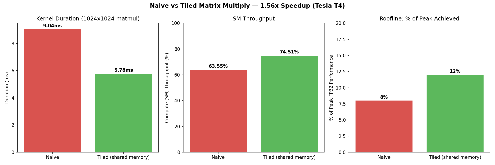

# CUDA Matrix Multiply: Naive vs. Shared-Memory Tiling

**1.56x speedup** (9.04ms → 5.78ms) on a 1024×1024×1024 matmul, achieved by moving redundant global memory reads into shared memory — profiled end-to-end with Nsight Compute on a Tesla T4.

## What this is

A from-scratch CUDA implementation of matrix multiplication, built to demonstrate the classic naive → tiled optimization and back it up with real profiler evidence rather than just a "it's faster" claim. Both kernels are hand-written (no cuBLAS), compiled with `nvcc`, and profiled with `ncu` (Nsight Compute).

## Results



| Metric | Naive | Tiled | Change |
|---|---|---|---|
| Duration | 9.04 ms | 5.78 ms | **1.56x faster** |
| Compute (SM) Throughput | 63.55% | 74.51% | +11pp |
| % of peak FP32 performance | 8% | 12% | +4pp |
| Warp "No Eligible" stalls | 84.93% | 80.37% | -4.5pp |
| L1/TEX Cache Throughput | 95.34% | 95.48% | ~unchanged |

## What the profiler revealed

The naive kernel's bottleneck wasn't DRAM bandwidth (only 7.55% utilized) — it was **L1 cache pipe congestion**. Every thread independently issued its own load instruction for `A[row][k]` and `B[k][col]`, even when neighboring threads in the same block needed the identical value. The cache was catching ~87% of these requests (a healthy hit rate), but the sheer volume of redundant *requests* saturated the cache pipe itself (95% throughput), leaving 85% of warps stalled with nothing eligible to execute despite near-perfect occupancy (98.65%).

The tiled kernel fixes this by having each thread block cooperatively load a 16×16 tile of A and B into shared memory once per iteration (64 iterations to cover K=1024), then reusing that tile from fast, uncontended on-chip memory instead of re-issuing redundant global loads. This cut duration by 36% and raised compute throughput meaningfully.

**Why it's not a complete fix**: L1 cache throughput is still saturated (95.48%) and warp stalls only dropped modestly (85%→80%). With a tile size of 16×16, each block still executes 64 `__syncthreads()` barrier pairs (128 total), and shared memory tile size limits how much reuse each load buys before the tile has to be reloaded. Larger tiles, register blocking, or thread coarsening would likely close more of the remaining gap — that's the natural next step (see below).

## How to reproduce

Environment: Google Colab, Tesla T4, CUDA 12.8 (`nvcc`), Nsight Compute 2025.1.1.

```bash
# Compile
nvcc -o matmul_naive src/matmul_naive.cu
nvcc -o matmul_tiled src/matmul_tiled.cu

# Run
./matmul_naive
./matmul_tiled

# Profile (full metric set)
ncu --set full -k matmulNaive ./matmul_naive
ncu --set full -k matmulTiled ./matmul_tiled
```

Raw profiler output saved in `benchmarks/`.

## What I'd do next

- Increase tile size (32×32) and measure the effect on cache pipe saturation
- Try register blocking / thread coarsening to reduce `__syncthreads()` overhead
- Compare against cuBLAS as an upper-bound reference point
- Test on a larger/different GPU architecture (A100/H100) to see how the bottleneck shifts
