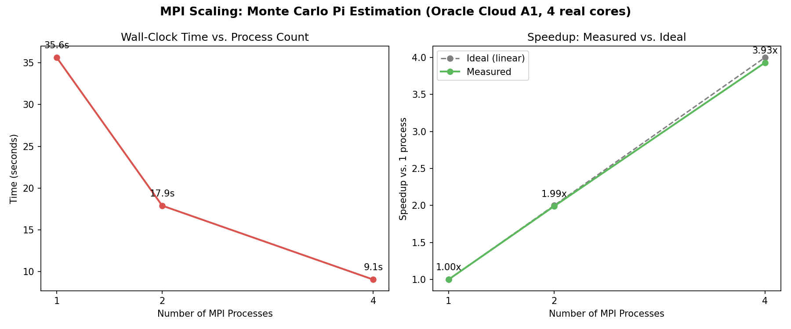

# MPI Scaling: Monte Carlo Pi Estimation

**3.93x speedup on 4 processes** (98.3% efficiency) on a genuine 4-core cloud VM — plus an honest look at why the *same code* showed negative scaling on a 2-core environment first.

## What this is

A Monte Carlo estimation of Pi, parallelized across MPI processes using `mpi4py`. Each process independently generates random points and counts how many fall inside a quarter circle; results are combined with a single `MPI.Reduce` call. This is an "embarrassingly parallel" workload — nearly all the work is independent, with only one small communication step at the end — making it a clean test of MPI's scaling behavior with minimal confounding overhead.

## Results (Oracle Cloud, 4-core Ampere A1, 100M total samples)



| Processes | Time | Speedup | Efficiency |
|---|---|---|---|
| 1 | 35.65s | 1.00x | 100% |
| 2 | 17.91s | 1.99x | 99.5% |
| 4 | 9.07s | 3.93x | 98.3% |

Scaling is close to ideal (linear). This matches the theoretical expectation from Amdahl's Law: since the only non-parallel portion of this program is one small `Reduce` call at the very end, the "sequential fraction" is tiny, so speedup approaches the number of processes almost exactly.

## An honest earlier result: negative scaling on 2 cores

Before moving to this dedicated VM, the same exact code was first tested on a Google Colab instance with only 2 shared CPU cores:

| Processes | Time |
|---|---|
| 1 | 37.04s |
| 2 | ~40s (**slower**, not faster) |

This wasn't a bug — it's a real, explainable hardware ceiling. With only 2 cores available and shared with the notebook environment's own background processes, adding a second MPI process introduced context-switching and contention rather than genuine parallel capacity. This result is included deliberately: it demonstrates the difference between a *correctness* problem and a *hardware capacity* problem, and shows the value of diagnosing which one you're looking at before assuming code is broken.

## How to reproduce

Environment: Oracle Cloud Always Free tier, VM.Standard.A1.Flex (4 OCPU, 24GB RAM, Ampere ARM), Oracle Linux 9, OpenMPI 4.1.1, mpi4py 4.1.2.

```bash
mpirun -np 1 python3 src/pi_estimate.py
mpirun -np 2 python3 src/pi_estimate.py
mpirun -np 4 python3 src/pi_estimate.py
```

## What I'd do next

- Provision a second node and test *true* multi-node scaling (network-based communication, not just multi-core on one machine) — this is the version that most directly demonstrates MPI's actual distributed-computing value proposition
- Test with a communication-heavier workload (not embarrassingly parallel) to see a more realistic efficiency curve with real communication overhead
- Compare `Reduce` vs `Allreduce` overhead directly at scale

## True multi-node scaling (2 separate physical machines)

To test genuine distributed scaling (not just multi-core on one machine), the same benchmark was run across two independent Oracle Cloud VMs (2 OCPU/12GB each), connected over a real network, using an MPI hostfile to distribute ranks across both.

| Processes | Single-node (4 cores, 1 machine) | Multi-node (2 nodes x 2 cores, real network) |
|---|---|---|
| 1 | 1.00x | 1.00x |
| 2 | 1.99x | 1.94x |
| 4 | 3.93x | 3.84x |

The multi-node version is consistently, slightly less efficient — a small but real and expected cost of crossing an actual network connection for inter-process communication, versus communicating within one machine's shared kernel/memory subsystem. The gap is modest here specifically because this workload is embarrassingly parallel (minimal communication); a communication-heavy workload would likely show a more pronounced difference.

Getting this working required two infrastructure steps beyond the single-node setup: opening the cloud network's security list for intra-subnet traffic, and disabling each node's local `firewalld` (both the cloud-level and OS-level firewalls block MPI's dynamic port usage by default). It also required setting up passwordless SSH trust from the launching node to the other, since `mpirun` starts remote processes via SSH under the hood.
