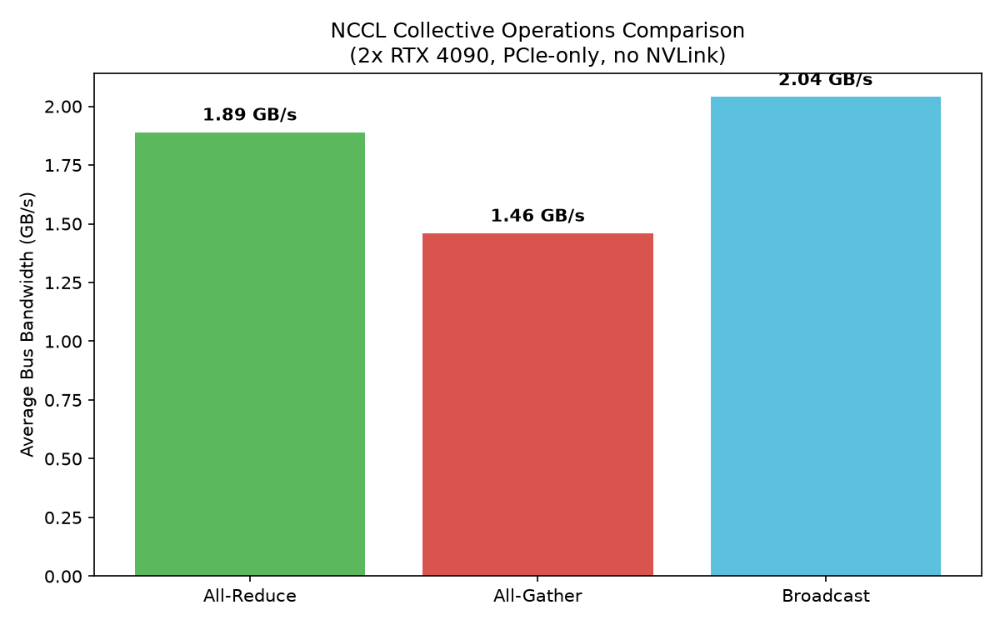

# NCCL Multi-GPU Benchmark: Collective Operations Comparison

**Broadcast (2.04 GB/s) outperforms All-Reduce (1.89 GB/s) and All-Gather (1.46 GB/s)** on a 2x RTX 4090 PCIe-connected system — measured with NVIDIA's official `nccl-tests` suite across message sizes from 8 bytes to 1GB.

## What this is

A benchmark of NVIDIA's NCCL (Collective Communications Library) across three fundamental multi-GPU collective operations: all-reduce, all-gather, and broadcast. Built and run using NVIDIA's official `nccl-tests` tool (not a custom benchmark) — the standard, real-world way this is measured in practice.

## An honest note on scope

The original plan for this project was to compare interconnects (NVLink vs. PCIe). This hardware — 2x RTX 4090 — doesn't have NVLink available: NVIDIA removed NVLink from consumer RTX 40-series cards entirely; it's now exclusive to workstation/datacenter GPUs (A6000, RTX 6000 Ada, A100, H100). Rather than force a comparison the hardware can't support, this benchmark instead compares collective **operations** over the same PCIe link — a different but equally standard and legitimate axis for characterizing NCCL performance, and one that reveals real, explainable differences in its own right.

## Results (2x RTX 4090, PCIe, message sizes 8B to 1GB)



| Operation | Avg Bus Bandwidth |
|---|---|
| Broadcast | 2.04 GB/s |
| All-Reduce | 1.89 GB/s |
| All-Gather | 1.46 GB/s |

## Why the differences make sense

- **Broadcast** is the simplest operation: one GPU sends identical data to the other. A single one-way transfer, so it's the fastest of the three.
- **All-Reduce** requires combining values (sum, in this benchmark) across GPUs and distributing the combined result back to both — genuinely more computational and communication work per byte than a plain broadcast.
- **All-Gather** is the most demanding here: every GPU ends up holding a full copy of every other GPU's data, meaning strictly more total bytes must physically cross the PCIe link than in either of the other two operations — which explains why it's the lowest despite being conceptually simpler than all-reduce.

All three plateau in the 3.5-4 GB/s raw bandwidth range at large message sizes (visible in the raw output in `benchmarks/`), consistent with typical PCIe Gen4 x16 bidirectional bandwidth limits for peer-to-peer GPU transfers without NVLink acceleration.

## How to reproduce

Environment: RunPod, 2x NVIDIA RTX 4090 (24GB), CUDA 13.0 driver / NCCL 2.31.2, Ubuntu 24.04.

```bash
git clone https://github.com/NVIDIA/nccl-tests.git
cd nccl-tests && make -j$(nproc)
./build/all_reduce_perf -b 8 -e 1G -f 2 -g 2
./build/all_gather_perf -b 8 -e 1G -f 2 -g 2
./build/broadcast_perf -b 8 -e 1G -f 2 -g 2
```

Raw output for all three runs saved in `benchmarks/`.

## What I'd do next

- Repeat this benchmark on NVLink-capable hardware (A6000, A100, or H100) to get the originally-planned interconnect comparison
- Test across actual multi-node NCCL (combining this with the MPI multi-node work from the earlier project) to compare intra-node PCIe vs. inter-node network bandwidth
- Profile a real training workload's collective communication pattern to see which of these operations actually dominates in practice
